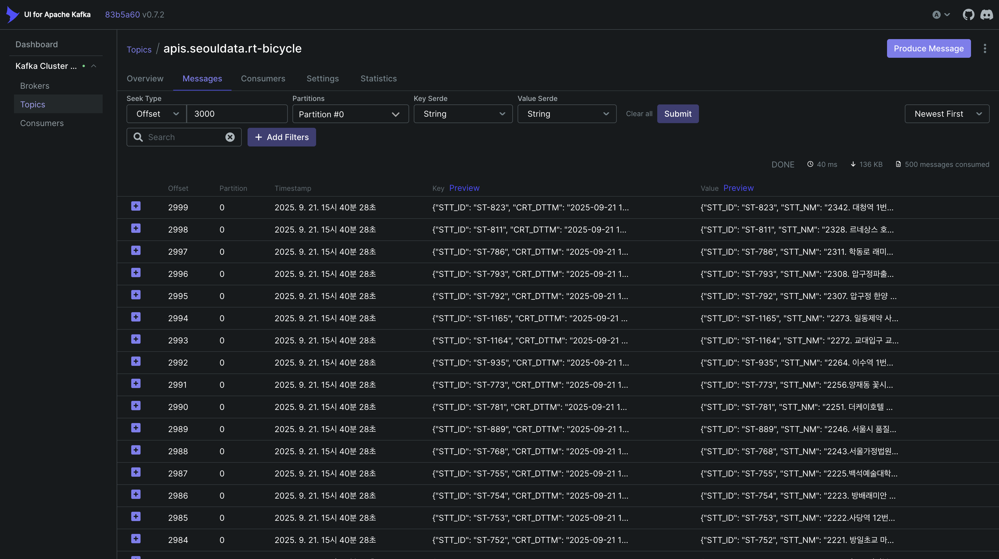
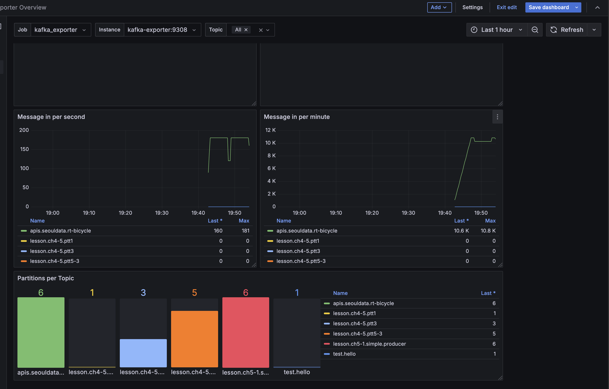
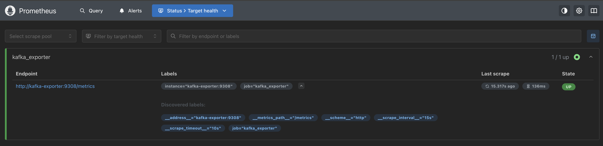

# kafka-producer

## hosts 추가

```bash

<퍼블릭 ip> kafka01
<퍼블릭 ip> kafka02
<퍼블릭 ip> kafka03
```

## Endpoint

| 구분                   | URL          | 비고                                               |
|----------------------|--------------|--------------------------------------------------|
| http://kafka02:8081  | UI for Kafka |  |
| http://kafka03:3000/ | Grafana      |       |
| http://kafka03:9090/ | Prometheus   |    |

## 참고자료

[강의 자료](https://github.com/hjkim-sun/datalake-kafka-producer-season1)
